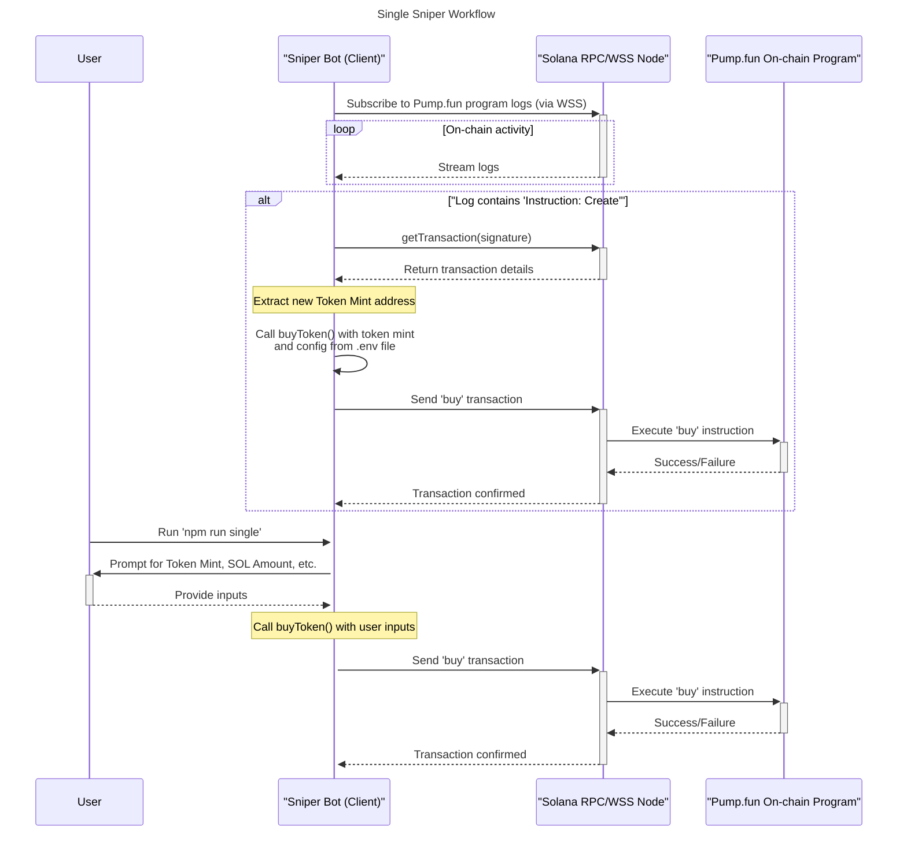

# Pump.fun Sniper Bot

A TypeScript-based sniper bot for the Pump.fun platform on the Solana blockchain. This bot can be used to automatically purchase newly created tokens or to snipe a specific token by its mint address.

## ❗ Disclaimer

This bot is provided for educational and experimental purposes only. Using a sniper bot carries significant financial risks, including the potential loss of your funds. The creators and contributors of this project are not responsible for any financial losses you may incur. Use this software at your own risk and always do your own research (DYOR) before investing in any token.

## ✨ Features

This bot offers two primary modes of operation:

-   **🚀 Automatic Sniper (`auto`)**: Monitors the Pump.fun platform for newly created tokens in real-time. When a new token is detected, the bot will automatically execute a buy transaction based on your predefined configuration.
-   **🎯 Single Sniper (`single`)**: Allows you to target a specific token for purchase. You provide the token's mint address, and the bot will execute a buy transaction.

## 🛠️ Technologies Used

-   [TypeScript](https://www.typescriptlang.org/)
-   [Solana Web3.js](https://solana-labs.github.io/solana-web3.js/)
-   [@coral-xyz/anchor](https://www.npmjs.com/package/@coral-xyz/anchor) for interacting with Anchor programs.
-   [esbuild](https://esbuild.github.io/) for fast TypeScript compilation.
-   [dotenv](https://www.npmjs.com/package/dotenv) for managing environment variables.
-   [inquirer](https://www.npmjs.com/package/inquirer) for interactive command-line prompts.

## 📋 Prerequisites

-   [Node.js](https://nodejs.org/) (v18 or higher is recommended)
-   A Solana wallet with some SOL to cover transaction fees and purchases.

## ⚙️ Installation & Setup

1.  **Clone the repository:**
    ```bash
    git clone https://github.com/0xTan1319/Pumpfun-Sniper-Bot
    cd Pumpfun-Sniper-Bot
    ```

2.  **Install dependencies:**
    ```bash
    npm install
    ```

3.  **Create and configure the environment file:**
    -   Create a new file named `.env` in the root of the project.
    -   You will need to add the required environment variables to this file. See the [Configuration](#-configuration) section below for details.

4.  **Build the project:**
    ```bash
    npm run build
    ```
    This will compile the TypeScript files from the `src` directory and output them to the `dist` directory.

## 🔧 Configuration

The bot is configured using a `.env` file in the root of the project.

### Required Variables

| Variable          | Description                                                                                              | Example                                   |
| ----------------- | -------------------------------------------------------------------------------------------------------- | ----------------------------------------- |
| `HTTPS_ENDPOINT`  | The RPC endpoint for connecting to the Solana network. A private RPC is highly recommended for performance. | `https://api.mainnet-beta.solana.com`     |
| `WSS_ENDPOINT`    | The WebSocket endpoint for your RPC. This is required for the automatic sniper.                          | `wss://api.mainnet-beta.solana.com`       |
| `SECRET_KEY`      | The secret key of your Solana wallet, in base58 format.                                                  | `[...your secret key...]`                 |
| `PUMPFUN_PROGRAM_ID` | The on-chain address of the Pump.fun program.                                                          | `6EF8rrecthR5Dkzon8Nwu78hRvfCKubJ14M5uBEwF6P` |

### Optional Variables (for Auto Sniper)

These variables are used by the automatic sniper mode.

| Variable        | Description                                                                 | Default |
| --------------- | --------------------------------------------------------------------------- | ------- |
| `BUY_AMOUNT`    | The amount of SOL to use for each automatic purchase.                       | `0.1`   |
| `SLIPPAGE`      | The slippage tolerance in percentage.                                       | `10`    |
| `PRIORITY_FEE`  | The priority fee in SOL to use for transactions to increase their priority. | `0.003` |

## 🚀 Usage

### Automatic Sniper

To start the automatic sniper, run the following command:

```bash
npm run auto
```

The bot will then start listening for new tokens on Pump.fun and will attempt to buy them as they are created.

### Single Sniper

To use the single sniper, run this command:

```bash
npm run single
```

The bot will then prompt you to enter the following information:

-   The token's mint address.
-   The amount of SOL you want to spend.
-   Your desired slippage percentage.
-   The priority fee you want to use.

## 📈 Architecture & Workflow

The following diagram illustrates the two main workflows of the bot:




## 📞 Contact

If you have any questions or need help, you can reach out via Telegram: [Telegram](https://t.me/Vlad20316)
